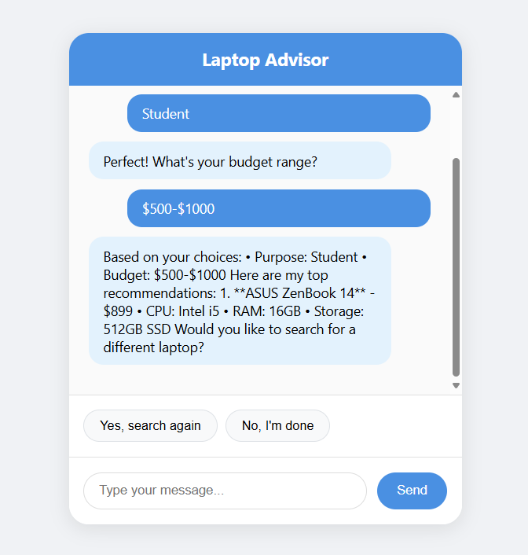
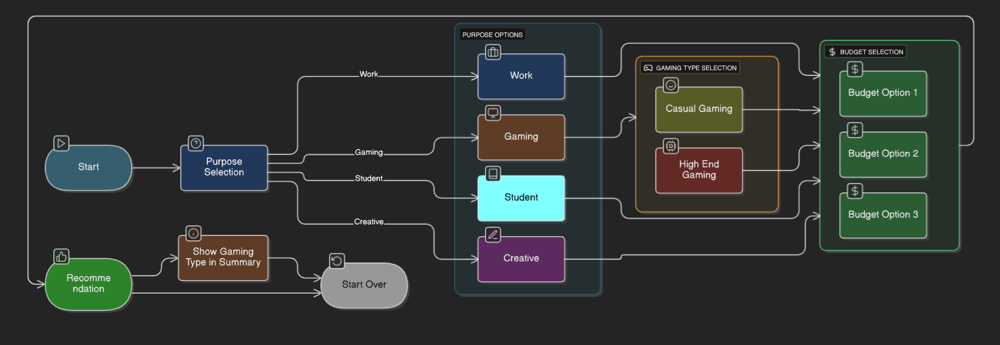

# 💻 eGain Laptop Advisor Chatbot

A sophisticated customer service chatbot designed for helping customers choose the perfect laptop based on their specific needs and preferences.

## 🎯 Project Overview

This project is a take-home assignment submission for eGain's Analyst I, Solution Success position. The chatbot demonstrates advanced conversation flow design, intelligent user interaction handling, and professional UI/UX implementation.

## 📋 Setup Instructions

### Prerequisites
- Node.js (version 14 or higher)
- npm or yarn package manager

### Installation
1. **Clone the repository**
   ```bash
   git clone https://github.com/ShawnAgustin/eGain_chatbot.git
   cd egain_chatbot
   ```

2. **Install dependencies**
   ```bash
   npm install
   ```

3. **Start the development server**

   ```bash
   npm start
   ```

4. **Open your browser**
   Navigate to `http://localhost:3000` to interact with the chatbot

## 🖼️ App Screenshots

Below are screenshots showcasing the eGain Laptop Advisor Chatbot in action:

| Home Screen                | Chatbot Conversation Flow      |
|----------------------------|-------------------------------|
|  |  |


**Shawn Agustin**  
Candidate for eGain Analyst I, Solution Success Position

